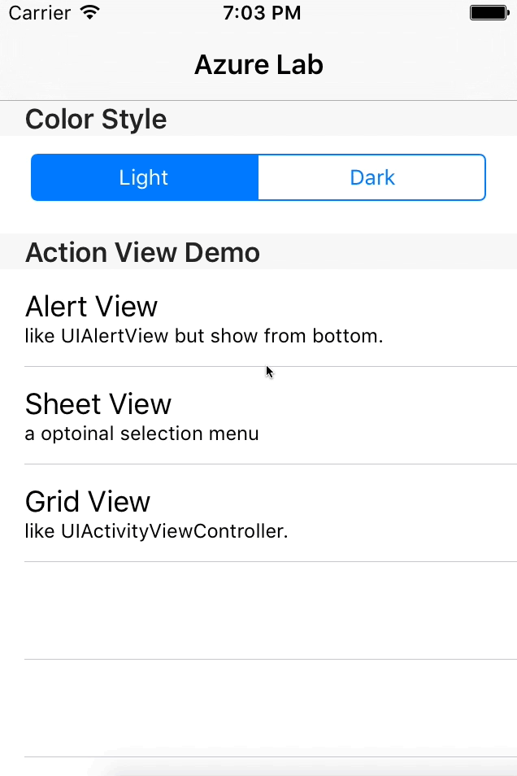
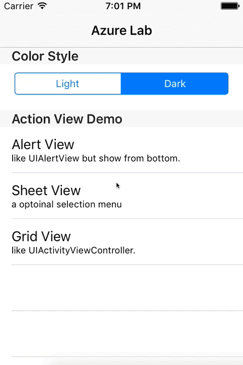
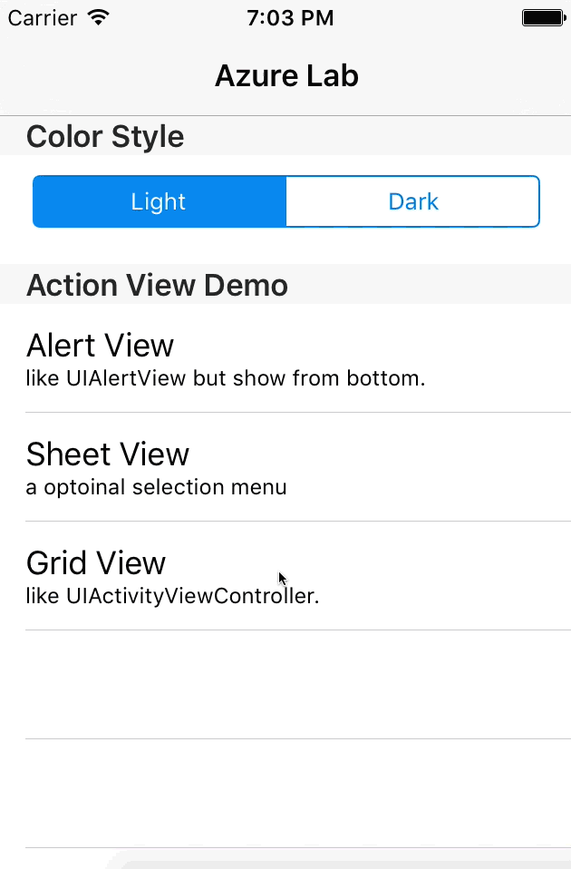
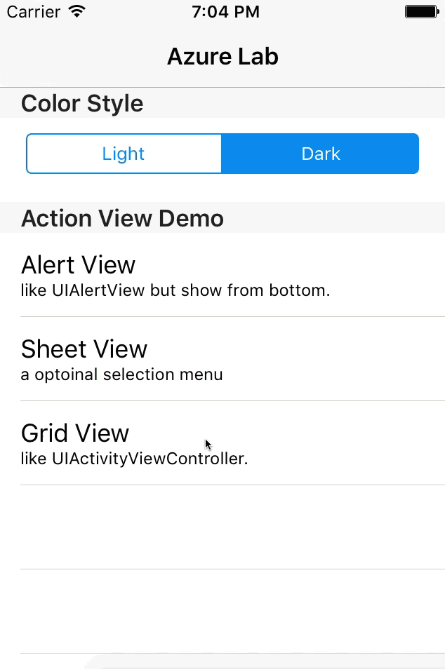

# RCActionView
[]()
[]()
[](https://travis-ci.org/Rodrigo/RCActionView)
[](http://cocoapods.org/pods/RCActionView)
[](http://cocoapods.org/pods/RCActionView)
[](http://cocoapods.org/pods/RCActionView)

RCActionView is a reimplementation of [sagiwei/SGActionView](https://github.com/sagiwei/SGActionView) written entirely in Swift. A customizable bottom menu, similar to Bottomsheet in Android. 

## Action Views

* RCAlertMenu，Similar to UIAlertView

White Style


Black Style


* RCSheetMenu

White Style


Black Style


* RCGridMenu，Similar to UIActivityViewController

White Style


Black Style


## Example
To run the example project, clone the repo, and run `pod install` from the Example directory first.

## Requirements

## Installation

RCActionView is available through [CocoaPods](http://cocoapods.org). To install
it, simply add the following line to your Podfile:

```ruby
pod "RCActionView", '~> 1.0.0'
```

## Author

Rodrigo, busntour@gmail.com

## License

RCActionView is available under the MIT license. See the LICENSE file for more info.
